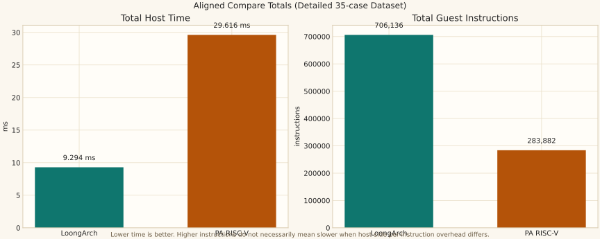
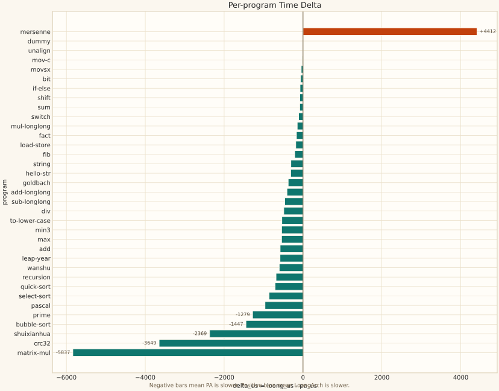
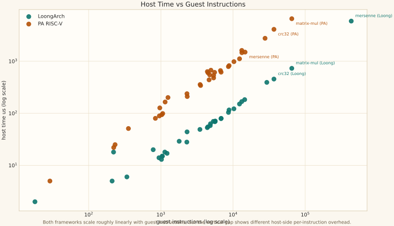
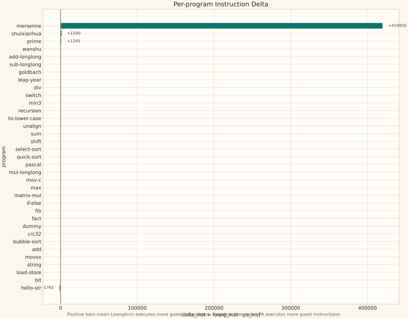

# LoongArch 与 PA `test_copy` 测试框架对齐分析

## 摘要

本文讨论两个教学型虚拟机测试框架的对齐问题：一边是 LoongArch 自研虚拟机及其 `test_copy` 测试链路，另一边是南京大学 PA 项目中的 RISC-V NEMU/AM `cpu-tests` 链路。本文的核心目标不是把两台虚拟机“伪装成同一种机器”，而是把它们在**测试集合、编译优化级别、计时窗口、结果字段**这四个框架层面拉到尽可能公平的同一起跑线。

对齐完成后，两边都只跑 35 个 `test_copy` 程序，都按 `-O0 -g` 构建，都以虚拟机内部执行循环的 `host time spent` 作为主时间口径，并统一输出 `status / host_time_us / host_time_ms / instructions`。最新正式 compare 结果显示：LoongArch 官方汇总 `Scored time = 9.811 ms`，PA 官方汇总 `Scored time = 29.616 ms`。在逐项详细数据中，LoongArch 在 35 个程序中的 34 个项目上更快，但 `mersenne` 是明显反例。

本文的主要结论有三点：

1. 这次工作已经把两个测试框架**对齐到可以严肃横向比较**的程度。
2. 这种对齐是“框架层对齐”，不是“机器级工作负载完全相同”。
3. LoongArch 总体更快，主要原因不是 guest 指令更少，而是**宿主机上每条 guest 指令的模拟成本明显更低**；`mersenne` 的反常，则来自 guest 指令流本身发生了剧烈分化。

## 数据来源与阅读说明

本文使用的数据和图表来自以下文件：

- `latest_aligned_compare_results.md`
- `docs/framework_alignment_paper_assets/aligned_compare_data.csv`
- `docs/framework_alignment_paper_assets/analysis_summary.json`

图表由如下命令生成：

```bash
cd /home/wimiw/dult-my-cpu-2026-main/dult-my-cpu-2026-main
python3 tools/generate_framework_alignment_figures.py
```

需要特别说明一件事：本文中“官方 compare 汇总时间”和“逐项详细表时间总和”并不完全相同。原因是逐项详细表是 compare 完成后再逐例提取的一次独立运行，`host time spent` 本身会有少量运行噪声。这种差异在微秒级测试里是正常现象。本文的总体结论主要依赖**逐项趋势与数量级差异**，而不是依赖某一次运行中的最后几个微秒。

## 1. 两个测试框架对齐前后的结构分析

### 1.1 两个测试框架对齐前的特点和结构具体介绍

#### 1.1.1 LoongArch 对齐前的结构

LoongArch 一侧的链路可以概括为：

```text
manifest -> build_c_program.sh -> build_runtime/*.bin -> mycpu_sim -> run_c_tests.sh 汇总
```

它实际测量的是：

- `runtime/start.S`
- `runtime/trap.c`
- 目标测试程序 `tests_copy/*.c`
- 在 `build/mycpu_sim` 中执行到 `goodtrap/badtrap`

LoongArch 对齐前的优点是“链路短、路径清楚”，但它有三个影响公平性的关键问题。

第一，**计时窗口偏大**。旧版 `toolchain/run_c_tests.sh` 是在 shell 外层用 `date +%s%N` 包围整个模拟器进程。这样得到的时间不仅包含虚拟机执行，还会包含：

- 进程创建
- 动态装载
- 程序镜像加载
- shell 调度
- 其他固定启动噪声

这会使短程序的时间统计明显失真。对于像 `dummy`、`mov-c` 这样的极短程序，真正的执行时间只有几微秒，但旧口径容易被毫秒级的外层固定开销淹没。

第二，**测试集合不纯**。旧版默认 manifest `tests/program/c_test_manifest.txt` 一共 42 项，前面混入了 7 个并不属于 `test_copy` 的程序，例如 `test_main`、`test_fail_main`、`test_check_fail`、`test_fib` 等。这意味着 LoongArch 的默认总时间不是纯粹的 `test_copy` 总时间。

第三，**结果字段不够标准化**。旧版 LoongArch runner 没有固定输出：

- `host time spent = ... us`
- `total guest instructions = ...`
- `simulation frequency = ...`

因此外层脚本很难像 PA 那样稳定提取“只属于执行主循环”的内部时间。

#### 1.1.2 PA 对齐前的结构

PA 一侧的链路可以概括为：

```text
cpu_test_runner.py -> 临时 Makefile -> AM/klib 构建 -> build/<name>-riscv32-nemu.bin -> NEMU -> runner 汇总
```

它实际测量的是：

- `abstract-machine/am`
- `abstract-machine/klib`
- `am-kernels/tests/cpu-tests/tests/*.c`
- 在 NEMU 中执行到 `HIT GOOD TRAP` 或 `HIT BAD TRAP`

PA 对齐前的优点是“结果采样点已经比较对”，因为 `cpu_test_runner.py` 会优先解析 NEMU 在 `cpu_exec()` 结束后打印的：

- `host time spent`
- `total guest instructions`

这比 LoongArch 原始方案更接近我们想要的 compare 标准。

但是，PA 对齐前也有三个不足。

第一，**默认测试集不是显式锁定的 compare 集合**。它默认是扫描 `tests/*.c` 自动发现测试，而不是显式规定 35 项 compare manifest 和固定顺序。

第二，**编译优化级别默认不对齐**。AM 默认构建使用 `-O2`，而 LoongArch 一侧默认是 `-O0 -g`。如果工作负载的编译策略不同，仅仅把计时口径对齐并不能称为“公平比较”。

第三，**时间模式不够严格**。旧 runner 在缺少内部 `host time spent` 时可能回退到别的时间来源，这不利于把 compare 模式定义成一套稳定的、可复现的标准。

#### 1.1.3 对齐前差异总表

| 维度 | LoongArch 对齐前 | PA 对齐前 |
| --- | --- | --- |
| 测试集合 | 默认 42 项，混入 7 个非 `test_copy` 程序 | 默认自动发现 `tests/*.c` |
| 编译优化 | `-O0 -g` | AM 默认 `-O2` |
| 主时间口径 | shell 外层墙钟时间 | NEMU `host time spent` 优先 |
| 时间回退 | 有，退回外层运行时间 | 有，缺失内部时间时可退回其他时间 |
| 结果字段 | 不固定输出 `host time spent` / `instructions` | 已较完整 |
| 主要风险 | 启动噪声主导短程序 | workload 与优化级别未被 compare 模式锁定 |

### 1.2 两个测试框架如何进行对齐的具体方法论

这次对齐遵循的是一种“分层对齐”的方法，而不是试图直接让两个 ISA 的二进制长得一样。具体来说，我们把问题拆成四层。

#### 第一层：工作负载对齐

原则是“先比较同一批程序，再比较时间”。

因此两边都新增了 compare manifest，并且固定为完全相同的 35 个 `test_copy` 程序与同一顺序。这样做的好处是：

- 总时间可直接对比
- 单项表格可逐行对齐
- 异常点可以在两边一一对应地分析

#### 第二层：编译条件对齐

原则是“同一测试集合必须在相同优化级别下构建”。

因此 compare 模式统一使用 `-O0 -g`。这里的目标不是追求最好性能，而是追求**可比较性**。教学项目里，`-O0` 更能减少编译器激进优化带来的不透明差异，使测试更接近“虚拟机如何解释执行这段程序”。

#### 第三层：计时窗口对齐

这是最关键的一层。我们把 compare 主时间统一定义为：

> 从虚拟机主执行循环开始，到 guest 程序通过 trap/halt 退出为止，宿主机实际花费的时间。

这一定义的意义是：把“编译、装载、外层脚本、进程启动”从 `Scored time` 中剥离出去，只留下真正想比较的核心对象，也就是**虚拟机执行 guest 程序本身的开销**。

#### 第四层：结果接口对齐

即使两边内部实现不同，只要输出接口一致，实验就更容易做统计和复现。因此 compare 模式都要求稳定产出：

- `status`
- `host_time_us`
- `host_time_ms`
- `instructions`

换句话说，我们对齐的不是“CPU 微结构”，而是“实验接口”。

#### 1.2.1 本次实际修改的代码点

LoongArch 一侧的核心修改包括：

- `include/SimulatorRunner.h`
- `src/SimulatorRunner.cpp`
- `src/simulator_main.cpp`
- `toolchain/run_c_tests.sh`
- `toolchain/run_c_tests_compare.sh`
- `tests/program/c_test_copy_manifest.txt`
- `toolchain/build_c_program.sh`

PA 一侧的核心修改包括：

- `am-kernels/tests/cpu-tests/scripts/cpu_test_runner.py`
- `am-kernels/tests/cpu-tests/Makefile`
- `am-kernels/tests/cpu-tests/compare_manifest.txt`
- `abstract-machine/Makefile`

这些修改并不是为了“美化输出”，而是为了把 compare 变成一套独立、稳定、可重复的实验通道。

### 1.3 对齐后的功能

对齐之后，两边的 compare 功能可以概括为：

- 只跑 35 个 `test_copy` 程序
- 都按 `-O0 -g` 构建
- `Scored time` 都来自虚拟机内部执行段 `host time spent`
- `Total time` 保留外层墙钟时间，但不再作为 compare 主口径
- 都能输出逐项 `status / host_time_us / host_time_ms / instructions`
- 都保留原有非 compare 入口，便于回归和兼容

从实验设计的角度看，这意味着 compare 模式已经具备了一个“基准测试框架”应有的基本要素：**输入固定、编译固定、统计固定、输出固定**。



图 1 展示了对齐后详细数据集的总览。一个非常关键的现象是：

- LoongArch 总 guest 指令数更高，为 706,136
- PA 总 guest 指令数更低，为 283,882
- 但 LoongArch 总 host time 反而更低，为 9.294 ms
- PA 总 host time 更高，为 29.616 ms

这说明“LoongArch 更快”并不是因为它做的事情更少，而是因为**它在宿主机上模拟每条 guest 指令的成本更低**。

## 2. 为什么 LoongArch 更快：结合两个虚拟机特点的具体分析

这一节要先澄清“更快”的含义。本文中的“更快”指的是：

> 同样在宿主机上运行一段 guest 程序，LoongArch 虚拟机消耗的 `host time spent` 更少。

这不是在说“LoongArch 指令本身天然比 RISC-V 指令更先进”，也不是在说“LoongArch guest 做的工作更少”。从实验数据看，恰恰相反，LoongArch 在很多程序上执行了**更多**的 guest 指令。

### 2.1 LoongArch 的执行主循环明显更轻

LoongArch compare 的主执行路径非常短。`runHexProgram()` 的核心循环就是：

- `cpu.step()`
- 递增步数统计
- 检查 `testDevice.halted()`

如果程序写入测试 MMIO 地址，runner 就立刻结束并返回。也就是说，LoongArch compare 的热点路径非常接近“纯解释执行 + 一个极简停机检测”。

相比之下，NEMU 的 `cpu_exec()` 在每条指令后除了执行 `isa_exec_once()`，还会做更多管理性工作：

- `g_nr_guest_inst++`
- `trace_and_difftest()`
- `check_watchpoints()`
- `device_update()`

即使某些功能没有真正触发，它们对应的函数调用、条件分支、时钟读取仍然会留在热路径里。对于几十万次指令执行来说，这些“每条指令多做一点”的成本会累积成很明显的总时间差。

### 2.2 NEMU 当前构建启用了更重的设备与调试基础设施

从当前源码和配置可以看到，PA 这次使用的 NEMU 构建启用了：

- `CONFIG_DEVICE`
- `CONFIG_HAS_VGA`
- `CONFIG_HAS_KEYBOARD`
- `CONFIG_HAS_AUDIO`
- `CONFIG_IRINGBUF`

这意味着 NEMU 不是一个只为 `cpu-tests` 裁剪到极限的最小解释器，而是一个带较完整设备模型和调试辅助设施的教学型模拟器。

具体体现在两点。

第一，`device_update()` 会在执行过程中定期处理设备时间、VGA 刷新和 SDL 事件队列。虽然它并不是每条指令都真正完成一次重设备更新，但**函数入口、时间检查和条件分支**本身就在执行热路径里。

第二，当前 NEMU 打开了 `IRINGBUF`。从 `cpu-exec.c` 可以看到，`exec_once()` 每执行一条指令都会记录到 ring buffer。这个设计对调试非常友好，但对 benchmark 来说显然增加了每条指令的宿主机开销。

LoongArch compare 路径则明显更“瘦身”。它的总线设备只有：

- `Memory`
- `Uart`
- `Timer`
- `TestDevice`

而且在当前 compare 主循环中，`Timer::tick()` 并没有出现在每条指令的主路径里。这一点非常重要：它既解释了 LoongArch 的低开销，也提醒我们它和 NEMU 仍然存在**不可忽略的结构差异**。换句话说，LoongArch 更快，部分原因就是它当前 compare 路径里“确实少做了一些事”。

### 2.3 runtime 与 trap 路径的复杂度也不同

LoongArch 侧的启动路径非常直接：

```text
_start -> main -> goodtrap/badtrap -> TestDevice MMIO
```

PA 侧的 AM/NEMU 路径则是：

```text
_start -> _trm_init -> main -> halt -> nemu_trap -> NEMU 处理 halt
```

表面上看，两者都在做“程序返回后告诉虚拟机退出”，但 PA 这一套路径背后包含了：

- AM 运行时封装
- trap/exception 处理约定
- NEMU 侧的 trap 分类与统计输出

这些设计并不是坏事。恰恰相反，它们体现了 PA/NEMU 作为教学平台更完整、更通用的一面。但对 micro-benchmark 来说，这些层次也意味着更多宿主机工作量。

### 2.4 真正决定总优势的，是每条 guest 指令的宿主机成本

如果只看总时间，很容易误以为“LoongArch 做得更少，所以更快”。但详细数据恰好说明并非如此。

在 35 个程序的详细数据里：

- LoongArch 总共执行 706,136 条 guest 指令
- PA 总共执行 283,882 条 guest 指令

尽管 LoongArch 执行了约 2.49 倍的 guest 指令，它的总时间却更少。换算成“每条 guest 指令平均花多少宿主机时间”，可以得到：

- LoongArch 约 `13.16 ns / inst`
- PA 约 `104.33 ns / inst`

也就是说，LoongArch 当前 compare 路径的**宿主机侧每指令成本**大约只有 PA 的八分之一左右。这个结论比“总时间更低”更重要，因为它更直接地解释了性能差异来自哪里。

更有说服力的是，把 `mersenne` 这个异常值拿掉之后再看：

- LoongArch：271,507 instructions，3,384 us
- PA：269,203 instructions，28,118 us

去掉 `mersenne` 后，两边的总 guest 指令数几乎一样，但 PA 仍然慢了一个数量级以上。这个结果非常强地支持了一个判断：

> 在大多数 `test_copy` 样例中，主导差异的是“虚拟机热路径的宿主机开销”，而不是“guest 程序做了不同量的工作”。

### 2.5 `mersenne` 是一个必须单独解释的反例

如果不分析 `mersenne`，我们就会误读结果。

`mersenne.c` 的热点计算里有这样一行：

```c
i = ((long long)i * i) % d;
```

这会触发 64 位取模辅助例程。LoongArch 侧的 `runtime/trap.c` 中包含了手写的 `__moddi3` 实现；PA 侧则通过 AM 构建链路引入了它自己的辅助实现。两边最终生成的 guest 指令流并不相同。

结果非常极端：

- LoongArch `mersenne`：434,629 instructions，5,910 us
- PA `mersenne`：14,679 instructions，1,498 us

这也是为什么 `mersenne` 成为 35 个程序里唯一一个 LoongArch 更慢的项目。换句话说：

- **总体更快**来自 LoongArch 的主循环更轻
- **单项例外**来自某些程序在两边生成了完全不同的 guest 执行流



图 2 非常直观地展示了这个现象。绝大多数程序都落在零轴左侧，表示 PA 更慢；只有 `mersenne` 明显落在右侧，表示 LoongArch 更慢。



图 3 则说明两边各自内部都呈现出“指令越多、时间越长”的近线性关系。两边时间与指令数的相关系数都接近 1：

- LoongArch：0.9996
- PA：0.9970

也就是说，**每台虚拟机内部**都很稳定；真正不同的是两条回归线的“纵向高度”。这正是“每条 guest 指令宿主机成本不同”的图形表达。

## 3. 实验样例分析：结合图表与表格的对比

### 3.1 全局统计

从详细逐项数据看：

- LoongArch 更快的程序数：34
- PA 更快的程序数：1
- PA 相对 LoongArch 的中位时间倍数：7.71x
- LoongArch 相对 PA 的整体吞吐优势：约 7.93x

这些数字说明，LoongArch 的优势不是靠某一两个幸运样例“抬上去”的，而是在绝大多数样例里都存在。

### 3.2 代表性样例表

下面选取几类最有代表性的程序。

| 程序 | LoongArch `host_time_us` | PA `host_time_us` | 谁更慢 | LoongArch `instructions` | PA `instructions` | 解释 |
| --- | ---: | ---: | --- | ---: | ---: | --- |
| `matrix-mul` | 731 | 6568 | PA 慢 5837 us | 65166 | 65177 | 指令数几乎一致，但 PA 时间高很多，说明主要差异在宿主机热路径 |
| `crc32` | 455 | 4104 | PA 慢 3649 us | 36873 | 36884 | 与 `matrix-mul` 类似，是“同量工作，不同宿主机成本”的典型 |
| `bubble-sort` | 168 | 1615 | PA 慢 1447 us | 13212 | 13223 | 小型算法也呈现同样趋势 |
| `hello-str` | 29 | 342 | PA 慢 313 us | 1793 | 3555 | PA guest 指令更多，但时间差远大于指令差，仍体现热路径差异 |
| `prime` | 183 | 1462 | PA 慢 1279 us | 14504 | 13259 | LoongArch guest 指令甚至更多，但总时间仍低很多 |
| `mersenne` | 5910 | 1498 | LoongArch 慢 4412 us | 434629 | 14679 | 明显的 guest 指令流分化异常值 |

这个表说明了两个很关键的实验事实。

第一，像 `matrix-mul`、`crc32` 这种程序，双方 guest 指令数几乎相同，但 PA 时间显著更高。这类程序最能说明问题，因为它们几乎排除了“guest 工作量不同”的干扰。

第二，像 `prime` 这样的程序，LoongArch 不但没有更少的 guest 指令，反而更多，但总时间仍明显更低。这进一步说明 LoongArch 的优势来自宿主机侧的解释执行成本。

第三，`mersenne` 则提醒我们：**一旦 guest 指令流严重分化，单项结果就不能简单归因为虚拟机框架本身**。

### 3.3 指令差异分析



图 4 展示了逐项 guest 指令差。它揭示了一个很容易被忽略的事实：

- 两边时间已经对齐到可以比较
- 但两边 guest 指令流并没有完全对齐

这不是缺陷，而是 ISA 不同、后端不同、runtime 不同的自然结果。也正因为如此，本文始终强调：

> 现在的结论是“测试框架对齐”，不是“机器级工作负载完全相同”。

如果未来还想进一步把结论推进到“guest 工作负载也尽量接近”，那么下一步就不再是改测试框架，而是要去研究：

- 两边编译器如何生成热点代码
- 64 位辅助函数如何被链接和调用
- runtime 与 trap 约定是否可以继续裁剪

### 3.4 这份实验结果能说明什么，不能说明什么

它能说明：

- 在当前 compare 标准下，LoongArch 虚拟机的宿主机执行效率更高
- 这种优势是系统性的，不是由少数个案撑起来的
- PA 当前 compare 构建中的设备与调试路径确实更重

它不能直接说明：

- LoongArch ISA 天然比 RISC-V ISA 更高效
- LoongArch guest 程序本身一定做了更少工作
- 两边在机器级上已经是完全相同的 benchmark

一个严谨的说法应该是：

> 在已对齐的 compare 框架下，LoongArch 当前虚拟机实现对这 35 个 `test_copy` 程序表现出更低的宿主机模拟开销；但由于 ISA、runtime 与 guest 指令流仍不同，这个结论仍应被理解为“框架级实验结论”，而不是“机器级绝对性能定论”。

## 结论

本文完成了两个层面的工作。

第一个层面是工程层面：我们把 LoongArch 和 PA 的 compare 测试框架对齐到了统一的实验接口。现在两边在测试集合、优化级别、计时窗口和结果字段上都已经处于一条清晰、可重复的 compare 通道中。

第二个层面是分析层面：通过逐项数据、总量统计和图形化结果，我们可以比较有把握地说，LoongArch 当前更快的主要原因不是“指令更少”，而是“宿主机每模拟一条 guest 指令所需的工作更少”。与此同时，`mersenne` 这个反例又提醒我们，框架对齐并不等于 guest 执行流对齐。

因此，最准确的最终表述是：

> 两个测试框架已经完成了高质量的 compare 对齐。  
> 在这一 compare 标准下，LoongArch 虚拟机整体更快。  
> 但这种结论仍然建立在“框架级公平”而不是“机器级完全同构”的前提上。

